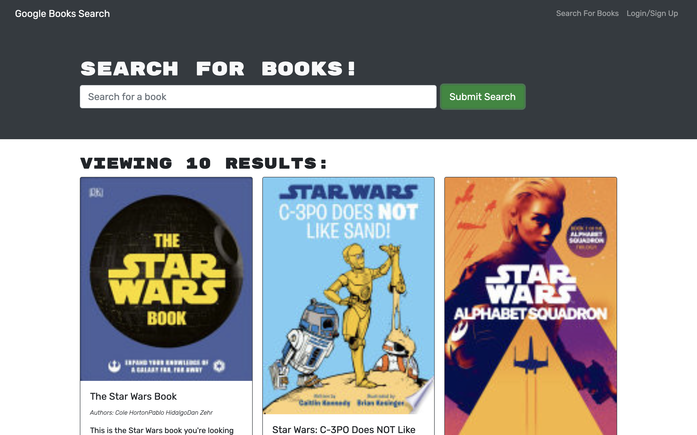

# Book Search Engine

## Description
This website allows you to search for books of your liking from a Google Book API. Based on your search there will be a list of books that match the description. You are also given the option to create an acount and sign in to that account. This is verified using JWTs to verify the user. When you are logged in you are able to add the books you wish to your book list. You can also remove them at a later time if you wish to do so.

## Built With
- JavaScript
- MongoDB
- GraphQL
- Apollo Client/Server
- Google Book API

## Screenshot

> This screen shot shows the landing page for the budget tracker.

## Website
(https://cryptic-ridge-02806.herokuapp.com/)

## Contribution
Made by Spencer Moyer
